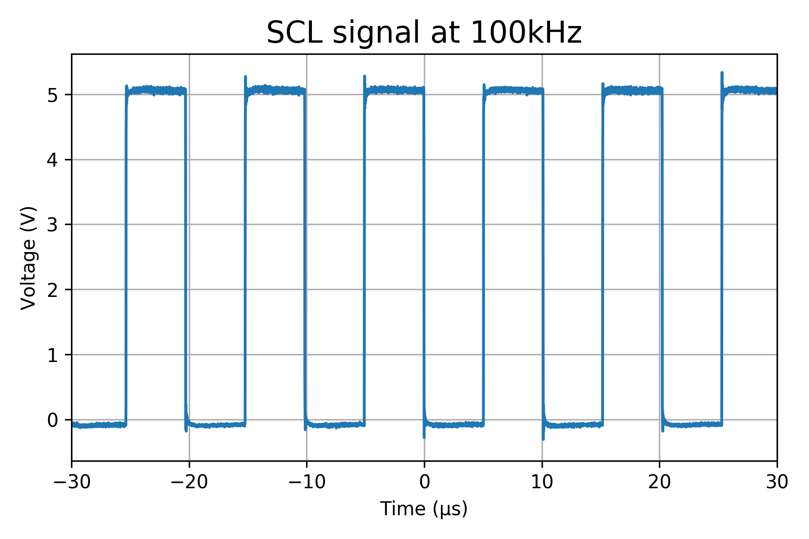
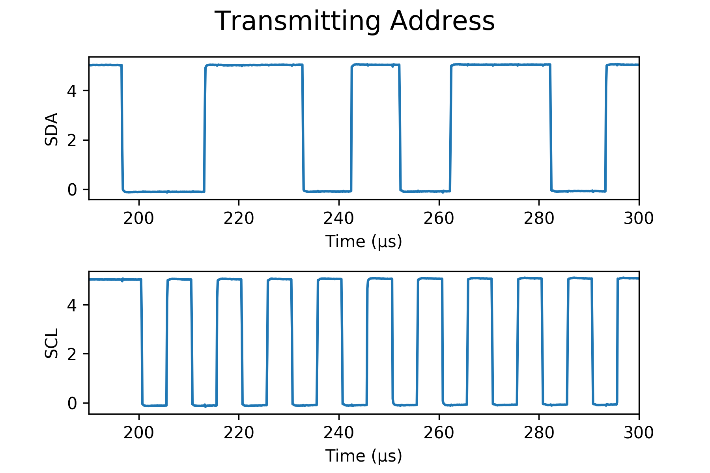

# Implementing I2C in C with Arduino
Jack Greenberg and David Tarazi

## 1 Project Goals
When we started with the project, our MVP was to get a couple of Arduinos communicating over a standard I2C communication protocol that we would write ourselves. We wanted to at least have a (somewhat) robust way to write a register and hoped to be able to read registers from the secondary device. While we didn't fully test and implement reading the secondary device, we were able to send a "Hello World" message from one device to another using our own implementation of the standard I2C protocol. As a reach, we hoped to be able to read values from a sensor and then send that data over to another device for a display. While we were close to this point, we never fully got there.


## 2 Learning Goals

### Jack

My main goal was to become more comfortable writing and debugging firmware, and this project was perfect because it forced me to learn how to debug code without having much feedback about works and what doesn't. I learned a lot about how AVR timers work and about manipulating bits. One of the coolest things I learned during the project was that initializing a variable carries a significant time delay when operating at the microsecond scale.

### David

I have worked with some embedded systems before, but never really understood what was happening at a low level when implementing sensors and reading those values. I wanted to learn more about how communication worked and how the software and hardware interacted in order to make the communication possible. I think I learned a lot about how these systems work and as an unforeseen learning experience, it was interesting to try to debug the system when it was operating on such a quick clock cycle time. Learning about how a single line or call to a function could cause errors with the communication timing made me so appreciative of the standard protocols already in place.


## 3 Useful Resources

The main resource we used for this project was a document from Texas Instruments entitled [*Understanding the I<sup>2</sup>C Bus*](https://www.ti.com/lit/an/slva704/slva704.pdf). The document details exactly how the I2C protocol works, including a range of topics from the details of the open-drain/open-collector electrical system to transmitting addresses and performing simple error checking with ACK/NACK.

We also used a document called [I2C Bus Pullup Resistor Calculation](http://www.ti.com/lit/an/slva689/slva689.pdf) (also from Texas Instruments) that explains the mathematics and physics behind choosing pull-up resistors to add to your I2C bus.

[This PDF](https://github.com/jack-greenberg/SoftSysI2C2/blob/master/resources/Timers.pdf) is a great guide to understanding AVR timers. There are a lot of ways to configure timers to get them to operate at the correct frequency.


## 4 Final Product

In the end, our code was able to transmit "Hello world" from an Arduino to be read by an Analog Discovery!

<figure align="center" width="50%"><figcaption>"Hello world" shown on an Analog Discovery</figcaption></figure>

The final code in `i2c.c` includes a `transmit_I2C` function that allows you to transmit a byte from a primary to a secondary device. There is also a framework for a `read_I2C` function that would allow you to read data from a secondary device, but we didn't have time to test it. 

The code that we have is meant to be portable to most AVR devices, and includes no Arduino macros or functions. We included a `Makefile` that can compile and flash Arduino from the terminal and also generates a `.a` file to be included in other embedded projects.

One issue with the code as it is right now is that it is a bit inconsistent, meaning that when you try to transmit "Hello world", you won't succeed 100% of the time. In fact, it is closer to 40-50% of the time. This is due to an issue with the way we set up our timer. We used a mode called CTC (explained more in <a href="#Design%20Decisions">Design Decisions</a>) which causes occasional lags in the I2C clock line throwing off the rest of the message. So sometimes you will end up transmitting "Hello w4$[SYN]" followed by an `ERR`. If we were to continue this project, we would probably look into using PWM (pulse width modulation) timer instead, which provides a more consistent frequency.

### Image Gallery

<div align="center">
    <figure>
        
    	<figcaption>Schematic of I2C Bus</figcaption>
    </figure>
    <br />
    <figure>
        
    	<figcaption>Fairly stable SCL (clock line) signal at 100kHz</figcaption>
    </figure>
    <br />
    <figure>
        
    	<figcaption>Transmission of address over I2C (0110101)</figcaption>
    </figure>
</div>


## 5 Design Decisions

### Timer

For the timer, we chose to use CTC (clear timer on compare) mode. This was in part because it was what we had the most experience with. CTC works by using the timer as a counter. You set a value to count up to and whenever counter hits that value, it resets. With a little bit of math you can set the value to give you a specific frequency. We used the equation *counter_value* = *frequency<sub>CPU</sub>* / *desired_frequency* * 2. However, in reviewing the datasheet of the ATmega328p (the chip on the Arduino), it appears as though PWM (pulse width modulation) would have been a better solution as it might have provided a more stable signal. If we were to continue the project further, we would choose this option.

### Messages

For messages, we chose for our transmit messages by encoding them into 8-bit ASCII codes. By using 8-bit, we could ensure that we would always be on a multiple of the I2C protocol and have the information coming through accurately. We chose to transmit characters one byte at a time to enable easy debugging and be able to see the letters coming through one at a time for analysis and looking at the timing of each bit's trasmission. In the future, we would wrap the single byte transmission into a function that could take a string and then transmit the whole string character by character or with a larger sequence for efficiency by reducing function calls which might actually matter with the time scale we are looking at.


## 6 Important Functions

As we break down the code, there are a few important features. First of all, we used an interupt-based system with a clock interval we set up in order to reach a timer frequency that would reset at a standard I2C frequency. Then, we had to write in the functionality for which device had control of the data line at any given time, which we didn't realize the importance of at first. When writing into another device's register, the primary device has control for the first 8 bits, but then has to give control up so that the secondary device can send an ACK or NACK bit back to indicate a successful transmission or not. To implement all of this in an integrated program, we chose to split our functionality into a few key functions:
    
 - *init_I2C()*: basic setup (ports, timer, interupts)
 - *ISR*: interupt service routine that flips the clock from high to low and vise versa
 - *start_I2C()*: sends the start condition for a transmission and indicated which secondary device and register to target
 - *transmit_I2C()*: sends a byte over SDA to secondary register
 - *read_ACK_NACK()*: reads the ACK/NACK bit from the secondary after each transmitted byte
 - *read_SDA()*: **unfinished** but intended to read a byte from the secondary register
 - *stop_I2C()*: sends the stop condition indicating the end of a transmission

Based on this outline, the init_I2C() function and ISR are pretty reasonably easy to read through, but essential to functionality. Diving into the start_I2C() function, a start condition happens when the data line (SDA) is pulled down while the clock is high. Following this shift, the primary can then specify the device address and register address to target for a read/write. Below is part of the start_I2C function where we pull SDA down while the clock is high, allowing us to begin writing bits.
```c++
/*** START CONDITION ***/

// Stall while 'phantom timer' is low until it goes high
while(!internalTimerFlag);

// Pull down SDA while timer is high
I2C_PORT &= ~_BV(SDA);

// SCL should be high, so next time ISR is triggered, SCL will go low
gStartTimerFlag = 1;

/*** END OF START CONDITION ***/
```
Once this has completed and error handling has occurred, we can write bits such as the ASCII encoded characters in a loop. To write a bit, we must wait until SCL is low and while it is low, we can then make changes to SDA. The secondary device will read SDA every time the clock is high. Shown below is the way that we write a single bit where the *bit* variable is either a 0 or 1. This is the bulk of the *transmit_I2C()* function.
```c++
// Stall until SCL is low
while(bit_is_set(I2C_PORT, SCL));

// If bit is 1, set SDA high, else set it low	
if (bit) {
    I2C_PORT |= _BV(SDA);
} else {
    I2C_PORT &= ~_BV(SDA);
}

// Stall until SCL is high again, then exit
while(bit_is_clear(I2C_PORT, SCL));
```
Then, in order to check of errors while writing bits, whether they are the device/register addresses or ASCII encoded characters, the primary must hand control of SDA over to the secondary so that the secondary device can write a single bit for the primary to read. The secondary device's job is to pull the SDA down to indicate a successful transfer. This functionality is implemented in *read_ACK_NACK()* as shown below.
```c++
int read_ACK_NACK(void) {

    while(bit_is_set(I2C_PORT, SCL)); // Secondary is reading previous value

    // Give up control of SDA
    I2C_PORT_DIRECTION_REGISTER &= ~_BV(SDA);
    I2C_PORT &= ~_BV(SDA);

    // Read SDA
    return bit_is_clear(PINB, SDA);
    // returns 1 (truthy) if ACK
    // returns 0 (falsey) if NACK
}
```
On the other hand, we would want the primary to also be able to read from the secondary's data registers. While this piece of the code is untested, there is value to showing how it would work. We would store the data in a buffer and be reading by every byte just as we were writing. The function to read a byte is shown below.
```c++
uint8_t get_byte(void) {
    // reads one byte and returns it
    uint8_t byte = 0;
    for (int i = 0; i < 8; i++) {
        // Stall until SCL is high
        while(!globalTimerFlag);
	// set the byte
        byte = (byte >> 7-i) | _BV(SDA);
        // Stall until SCL is low again
        while(globalTimerFlag);
    }
    return byte;
}
```
Then, in order to check for reading errors, we would need the primary to send an ACK/NACK bit back to the secondary to confirm a success and to continue transmitting data back to the primary; we have not implemented this functionality. Finally, once we have finished transmitting or reading data, *stop_I2C()* pulls the data line from low to high while the clock is high to end the communication protocol. 

To view the source code, you can find it on Github [here](https://github.com/jack-greenberg/SoftSysI2C2) in the documents i2c.c and i2c.h.

## Reflection

In the end, this was a successful project. Our MVP was to have two Arduinos communicate with one another via I2C, and while we weren't able to do this because we didn't have the necessary equipment after departing Olin, we *were* able to get an Analog Discovery to read "Hello world" from an Arduino, so we consider that a success. It would have been nice to get a `read` function working as well, but it would have required a lot more time than we had.

### Jack's Reflection

I felt that I exceeded my goals. I feel much more comfortable now with embedded software, and I have developed an intuition about how to debug firmware. It has also deepened my understanding of C and how programs run at a very low level. I'm very glad I chose this project and took a lot away from it. I may continue working on it and develop it into a mature library with more students and open source it, especially because I haven't found any other examples of people doing an implementation of I2C *from scratch*. From what I've found, it has always been libraries that take advantage of I2C functionalities built into AVR chips, whereas our library just uses bit manipulation.

### David's Reflection

I think that I reached my goals even though we didn't even fully reach the MVP. I learned a lot about clocks, timers, and embedded systems especially when working with them at a time scale where even a few function calls can create errors. While it was frustrating at times, I think I have a better intuition for registers, communications, and clocks. I also think this cemented my understanding of bit shifting and alterations at the bit level. While we didn't reach a super robust implementation, I feel that the thought process to get it to work at all was significantly helpful. I'm glad that I barely looked at example code for this project because the feeling of it being from scratch really shined through and the design decisions we made and went back to alter helped me learn.
